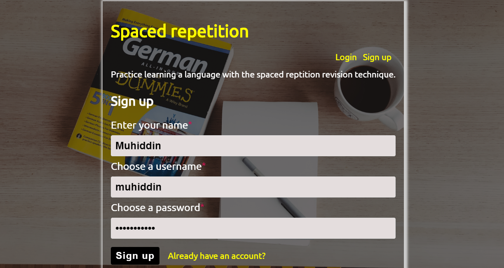
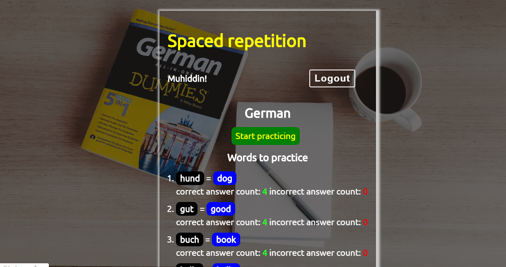
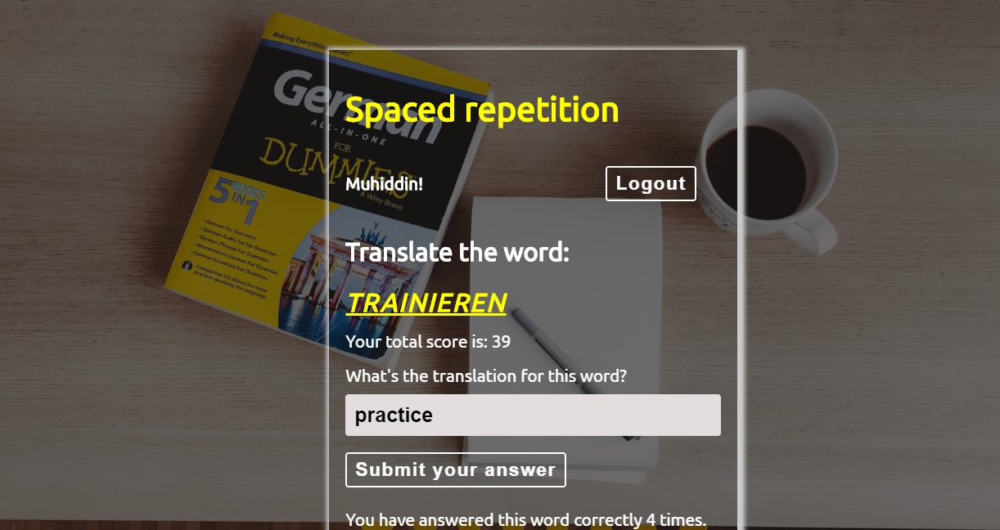
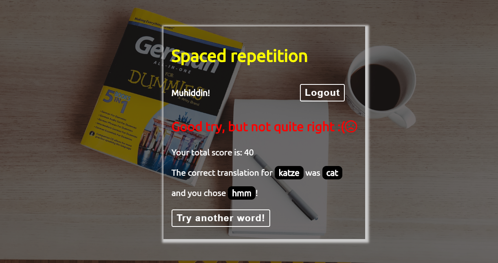
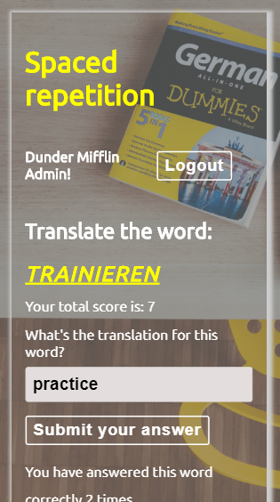
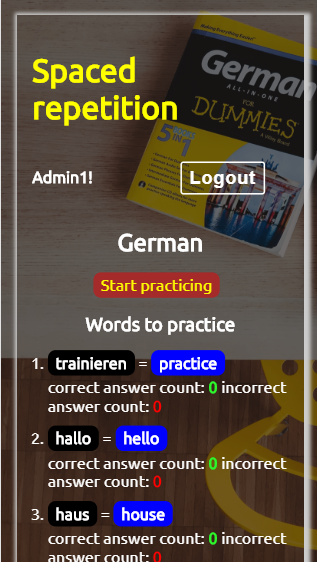
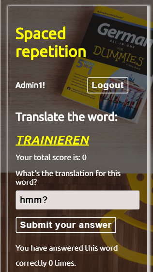
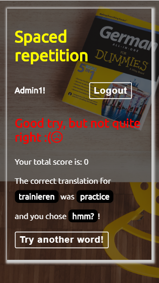
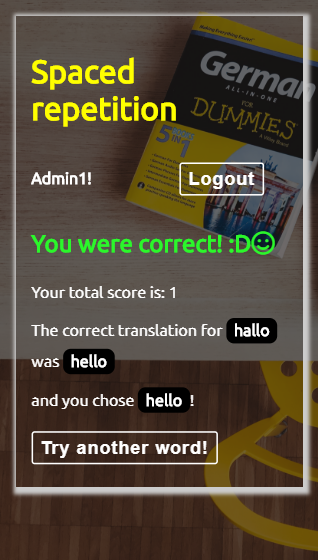

# Spaced Repetition Capstone!

This is an amazing user- and mobile-friendly app for new language learners. It interactively engages a user to play with new words and efficiently helps memorize them very fast. It also tracks user answers feedback(correct counts, incorrect counts, total scores).

[Client repo](https://github.com/thinkful-ei-macaw/spaced-repetition-client-mpg)

[Server repo](https://github.com/thinkful-ei-macaw/spaced-repetition-server-mpg)

[Live](https://duolang.org/)

Designed by [Glen](https://github.com/Nekotree) & [Muhiddin](https://github.com/muhiddinsgithub) & [Patrick](https://github.com/7eyedhero)

# Screenshots

# DESKTOP VIEW

# MOBILE VIEW

### Stack

#### Front-end technologies
React, React Context API, React Router, HTML, CSS, CSS Flexbox, JavaScript

#### Server technologies
Node, Express

#### Data persistence
PostgreSQL

#### Testing environments
Cypress, Mocha

#### Hosting
Client: now(zeit/vercel), godaddy.com(domain)  
Server/Database: heroku

